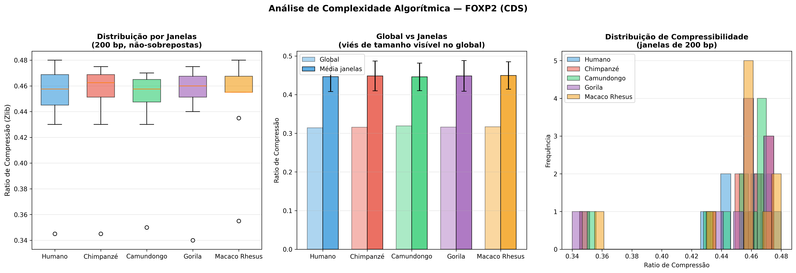
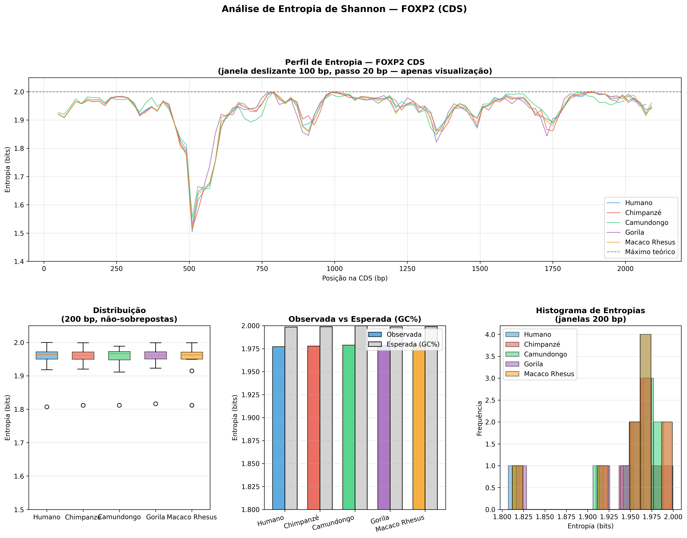

# Projeto LOGOS: Análise de Complexidade Algorítmica do Gene FOXP2

## Visão Geral

Este projeto aplica métricas de **Teoria da Informação** (Entropia de Shannon e Complexidade de Kolmogorov via Zlib) e **inferência estatística** para comparar a sequência codificante (CDS) do gene FOXP2 em cinco espécies de mamíferos: *Homo sapiens*, *Pan troglodytes*, *Mus musculus*, *Gorilla gorilla* e *Macaca mulatta*.

O FOXP2 codifica um fator de transcrição essencial para o desenvolvimento da fala e linguagem em humanos. A proteína é notavelmente conservada entre mamíferos — diferindo em apenas 2 aminoácidos entre humanos e chimpanzés, e em 3 entre humanos e camundongos.

### Histórico de Versões

**v2.0 (Fevereiro de 2026) — Metodologia revisada.** A análise original (v1) comparava isoformas não equivalentes de mRNA, produzindo uma diferença de tamanho artificial de 64% e divergência informacional espúria. Esta versão corrige três falhas críticas:

1. **Controle de isoformas:** CDS extraída de isoformas canônicas via accession numbers fixos do RefSeq, eliminando artefatos de tamanho causados pelas UTRs.
2. **Correção do viés de tamanho:** Janelas não-sobrepostas de 200 bp para análise de compressão, eliminando o viés de dicionário do DEFLATE.
3. **Tamanho de efeito:** Cohen's d reportado junto com p-values, prevenindo inflação de significância estatística por janelas autocorrelacionadas.

---

## Resultados Principais

Ao comparar sequências codificantes equivalentes, **todas as cinco espécies são informacionalmente indistinguíveis** no FOXP2:

| Comparação | Δ Entropia (bits) | p-value | Cohen's d | Δ Compressão | p-value | Cohen's d |
|---|---|---|---|---|---|---|
| Humano vs Chimpanzé | −0,0004 | 0,988 | 0,007 | 0,0020 | 0,909 | 0,052 |
| Humano vs Camundongo | +0,0006 | 0,979 | 0,012 | 0,0005 | 0,976 | 0,013 |
| Humano vs Gorila | −0,0012 | 0,961 | 0,022 | 0,0020 | 0,910 | 0,051 |
| Humano vs Macaco Rhesus | −0,0001 | 0,998 | 0,001 | 0,0030 | 0,859 | 0,081 |

Todos os valores de Cohen's d estão abaixo de 0,10 (efeito negligenciável). As CDS diferem em no máximo 0,6% entre as espécies, contra 215% de diferença no mRNA completo — confirmando que os resultados originais eram artefatos de seleção de isoforma.

### Visualizações





---

### O que a análise original errou

| Métrica | Original (v1) | Corrigido (v2) |
|---|---|---|
| Sequências comparadas | mRNA (isoformas diferentes) | CDS (isoformas canônicas) |
| Tamanho humano | 6.618 bp | 2.148 bp |
| Tamanho chimpanzé | 2.380 bp | 2.151 bp |
| Diferença de tamanho | 64% | 0,1% |
| Diferença de entropia | 0,0225 bits (p < 0,000001) | 0,0004 bits (p = 0,988) |
| Janelas | Sobrepostas (passo=1) | Não-sobrepostas (200 bp) |
| Tamanho de efeito | Não reportado | Cohen's d = 0,007 |

---

## Fontes de Dados

Sequências obtidas do NCBI RefSeq com accession numbers controlados:

| Espécie | Accession | CDS (bp) | Proteína (aa) |
|---|---|---|---|
| *Homo sapiens* | NM_014491 | 2.148 | 715 |
| *Pan troglodytes* | NM_001009020 | 2.151 | 716 |
| *Mus musculus* | NM_053242 | 2.145 | 714 |
| *Gorilla gorilla* | XM_063708043.1 | 2.139 | 712 |
| *Macaca mulatta* | NM_001033021.1 | 2.145 | 714 |

---

## Pipeline

### Requisitos

```bash
git clone https://github.com/maurizioprizzi/project-logos.git
cd project-logos
python3 -m venv .venv
source .venv/bin/activate
pip install biopython matplotlib numpy scipy
```

### Execução

```bash
# Passo 1: Download das sequências (requer internet)
python3 coletas_dados.py

# Passo 2: Estatísticas básicas e validação de comparabilidade
python3 analise_basica.py

# Passo 3: Análise de compressão Zlib (janelas não-sobrepostas)
python3 analise_avancada.py

# Passo 4: Entropia de Shannon com tamanhos de efeito
python3 calculo_entropia.py
```

Cada script é independente e produz saída no terminal e figuras em alta resolução (PNG, 300 dpi).

### Arquivos de Saída

| Arquivo | Descrição |
|---|---|
| `*_foxp2_cds.fasta` | Sequências codificantes por espécie |
| `*_foxp2_mrna.fasta` | mRNA completo por espécie (referência) |
| `metadados.json` | Metadados da coleta |
| `compressao_foxp2.png` | Figura da análise de compressão |
| `entropia_foxp2.png` | Figura da análise de entropia |

---

## Tecnologias Utilizadas

- **Python 3.12**
- **BioPython** — Download e extração de CDS do GenBank
- **SciPy** — Teste t de Welch, Mann-Whitney U, teste de Levene
- **NumPy / Matplotlib** — Análise numérica e visualização
- **Zlib** — Compressão DEFLATE como proxy da Complexidade de Kolmogorov

---

## Lições Aprendidas

Este projeto serve como estudo de caso em metodologia de bioinformática computacional:

1. **A seleção de dados determina o resultado.** Comparar isoformas não equivalentes criou uma diferença de 64% que não existe na biologia. Accession numbers específicos para isoformas canônicas são essenciais.
2. **Significância estatística ≠ significância prática.** Com milhares de janelas autocorrelacionadas, qualquer diferença trivial produz p < 0,000001. O tamanho de efeito (Cohen's d) é indispensável.
3. **Algoritmos de compressão têm viés de tamanho.** O DEFLATE comprime melhor sequências mais longas. Janelas não-sobrepostas de tamanho fixo eliminam esse confundidor.

---

## Autor

**Maurizio Prizzi**
*Professor de Otimização e Ciência de Dados*

## Licença

MIT