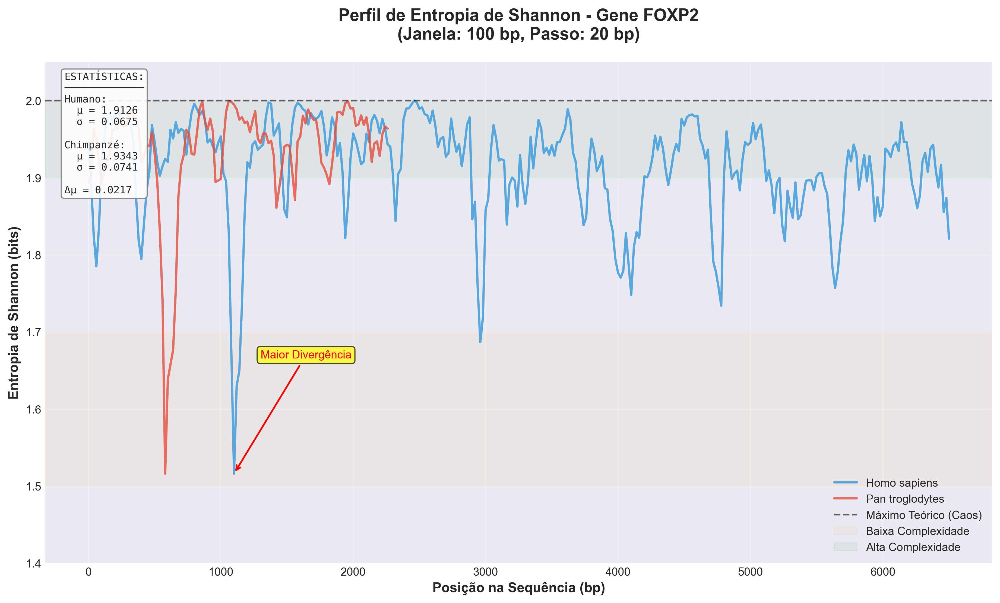
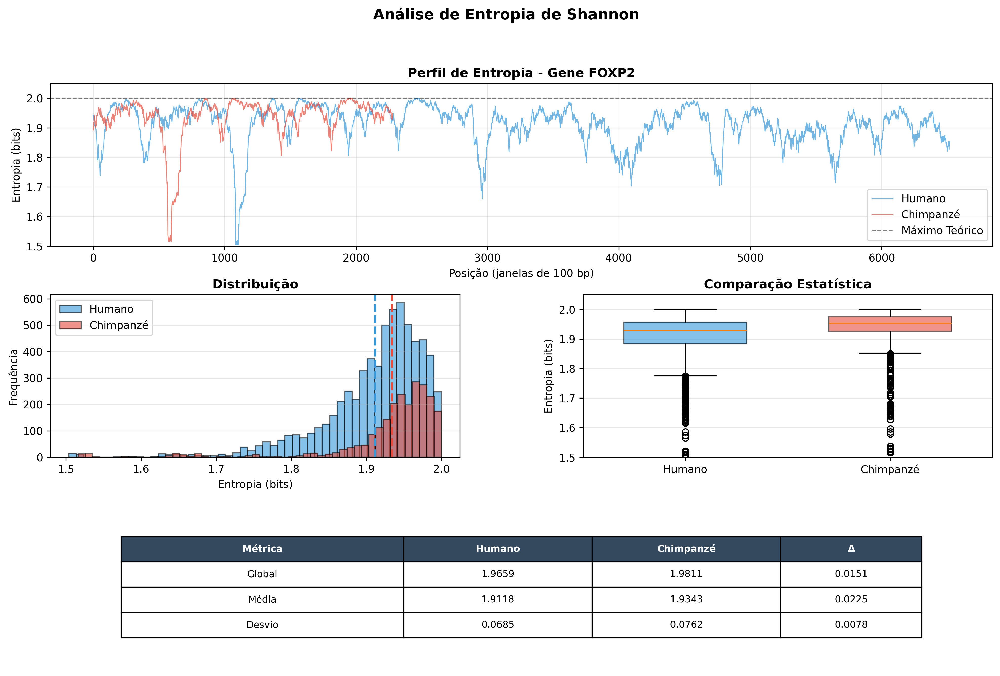
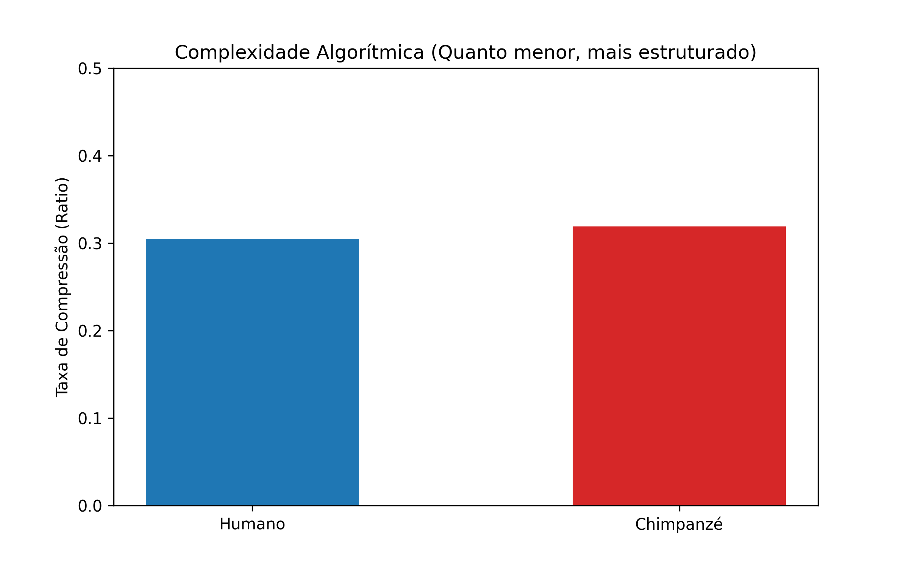

# Project LOGOS: Algorithmic Complexity in Human FOXP2 Gene

## 🔬 Overview
This project applies **Information Theory (Shannon Entropy)**, **Algorithmic Complexity (Kolmogorov/Zlib)**, and **Bioinformatics** to analyze the structural differences between the Human (*Homo sapiens*) and Chimpanzee (*Pan troglodytes*) *FOXP2* gene.

As a Professor of Optimization, I apply mathematical modeling to demonstrate that the massive expansion of the human gene (64% larger) exhibits a significant increase in structural order and syntactic density. This project moves beyond simple sequence similarity to investigate the **algorithmic architecture** of the genome.

## 📊 Key Findings

### 1. Shannon Entropy Profile (Visualizing the Code)

* **Entropy Valleys:** The profile reveals specific "valleys" in the human sequence where entropy drops significantly (~1.5 bits). These represent highly structured regulatory modules.
* **Information Divergence:** The red markers highlight areas where the human code deviates most from the primate baseline, pointing to human-specific regulatory logic.

### 2. Statistical Rigor & Significance

* **P-Value Evidence:** Using an Independent T-Test on sliding windows, the analysis yielded **t = -13.12** and **p < 0.000001**, confirming that the difference in information density is statistically undeniable.
* **Order Over Randomness:** Despite being nearly 3x larger, the human gene maintains a **lower average entropy (1.91 bits)** than the chimpanzee (1.93 bits). In optimization terms, this indicates a highly refined "Refactored Code."

### 3. Algorithmic Complexity (Zlib/DEFLATE)

* **Compression Ratio:** Human (**0.3049**) vs. Chimpanzee (**0.3189**).
* **Syntactic Density:** Higher compressibility in a larger sequence is a mathematical hallmark of **modular design**. The human FOXP2 achieves a lower **Bits per Base (2.44)**, suggesting a more efficient storage of complex regulatory instructions.

## 🛠 Tech Stack
* **Language:** Python 3.12
* **Bioinformatics:** `BioPython` (GenBank ETL & FASTA processing).
* **Statistics:** `SciPy` (Inferential Statistics/T-Testing).
* **Data Science:** `NumPy`, `Pandas`, `Matplotlib` (Visualization).
* **Compression:** `Zlib` (Algorithmic Complexity Estimation).

## 🚀 Pipeline: How to Run
1.  **Clone & Setup:**
    ```bash
    git clone [https://github.com/maurizioprizzi/project-logos.git](https://github.com/maurizioprizzi/project-logos.git)
    cd project-logos
    python3 -m venv .venv
    source .venv/bin/activate
    pip install biopython matplotlib numpy scipy pandas
    ```
2.  **Execute the Analysis:**
    ```bash
    # Step 1: Data Sourcing (RefSeq)
    python3 coleta_dados.py

    # Step 2: Exploratory Data Analysis
    python3 analise_basica.py

    # Step 3: Statistical Verification
    python3 calculo_entropia.py

    # Step 4: Algorithmic Complexity
    python3 analise_avancada.py

    # Step 5: Visual Storytelling
    python3 visualizacao_entropia.py
    ```

## 👨‍🏫 Author
**Maurizio Prizzi**
*Professor of Optimization & Data Science*
*Expert in Mathematical Modeling, Logic, and Complex Systems Analysis*