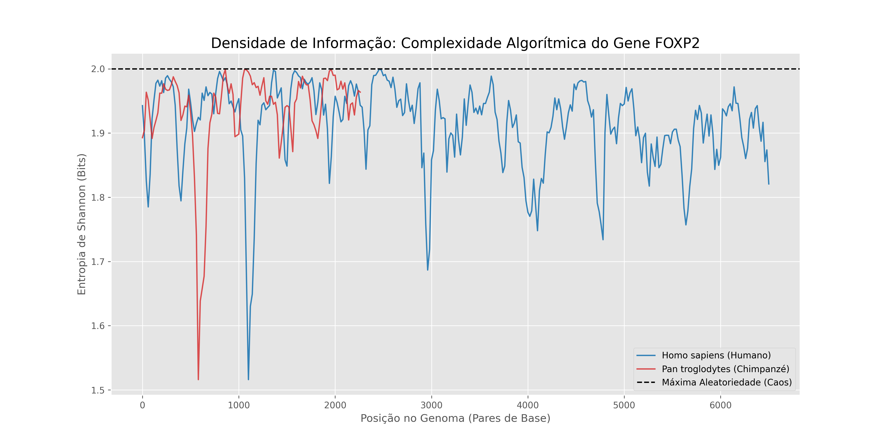

# Project LOGOS: Algorithmic Complexity in Human FOXP2 Gene

## 🔬 Overview
This project applies **Information Theory (Shannon Entropy)** and **Bioinformatics** to analyze the algorithmic differences between the Human and Chimpanzee *FOXP2* gene (associated with language and cognition).

While evolutionary biology often focuses on protein-coding similarity (~98%), this project investigates the **informational density** of the mRNA transcripts, revealing significant structural divergence in non-coding regulatory regions.

## 📊 Key Findings


1.  **Length Discrepancy:** The Human transcript (~6.6kb) is nearly **3x larger** than the Chimpanzee transcript (~2.4kb).
2.  **Entropy valleys:** The human-exclusive region (3' UTR) exhibits specific areas of **low entropy (<1.8 bits)**, suggesting high algorithmic structure and regulatory syntax rather than random evolutionary "noise".

## 🛠 Tech Stack
* **Language:** Python 3.12
* **Libraries:** BioPython, NumPy, Matplotlib, SciPy
* **Data Source:** NCBI GenBank (Dynamic Fetching)
* **Concepts:** Shannon Entropy, Sliding Window Analysis, GC Content.

## 🚀 How to Run
1.  Clone the repository:
    ```bash
    git clone [https://github.com/maurizioprizzi/project-logos.git](https://github.com/maurizioprizzi/project-logos.git)
    ```
2.  Install dependencies:
    ```bash
    pip install biopython matplotlib numpy
    ```
3.  Run the analysis pipeline:
    ```bash
    python3 visualizacao_entropia.py
    ```

## 👨‍🏫 Author
**Maurizio Prizzi**
*Professor of Optimization & Data Science*
*Expert in Mathematical Modeling & Logic*